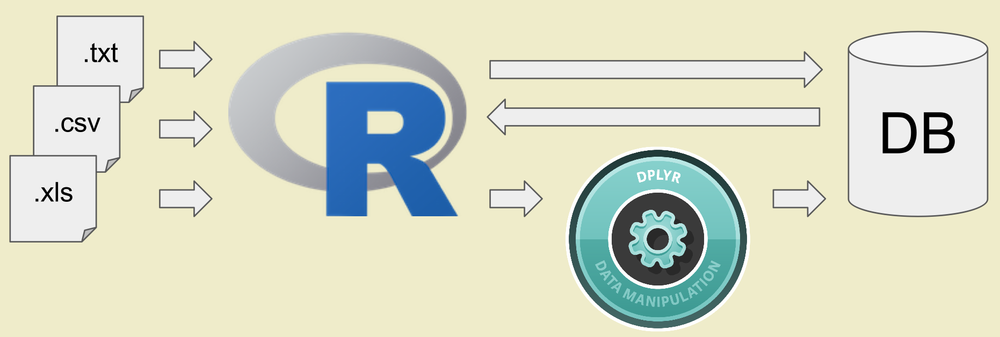
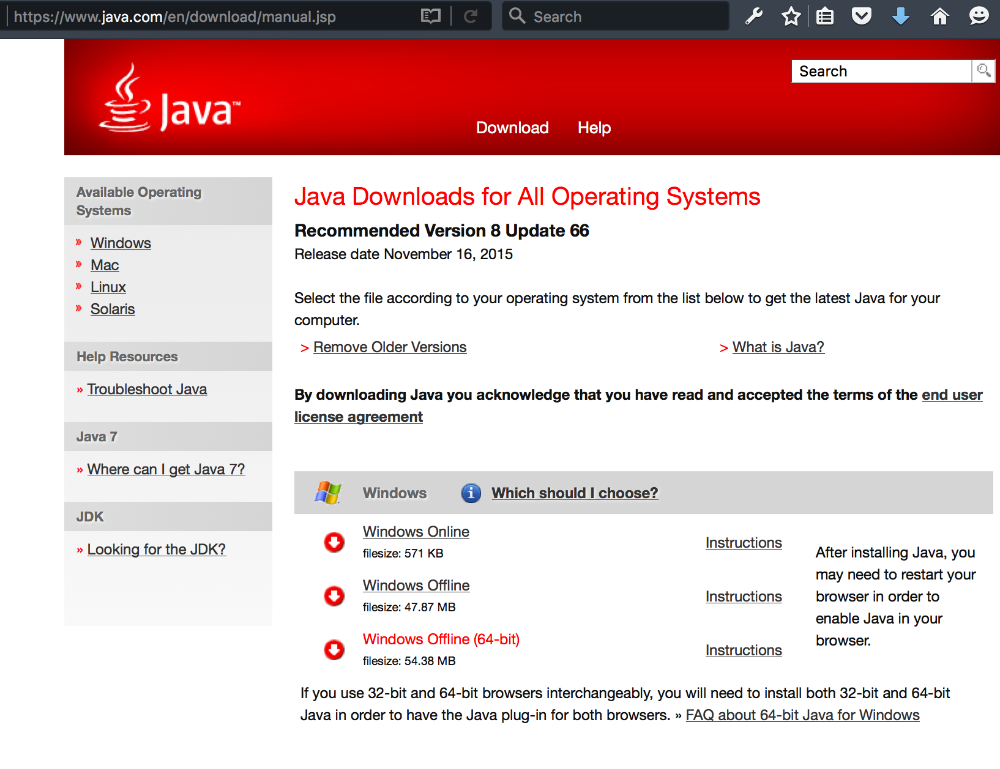
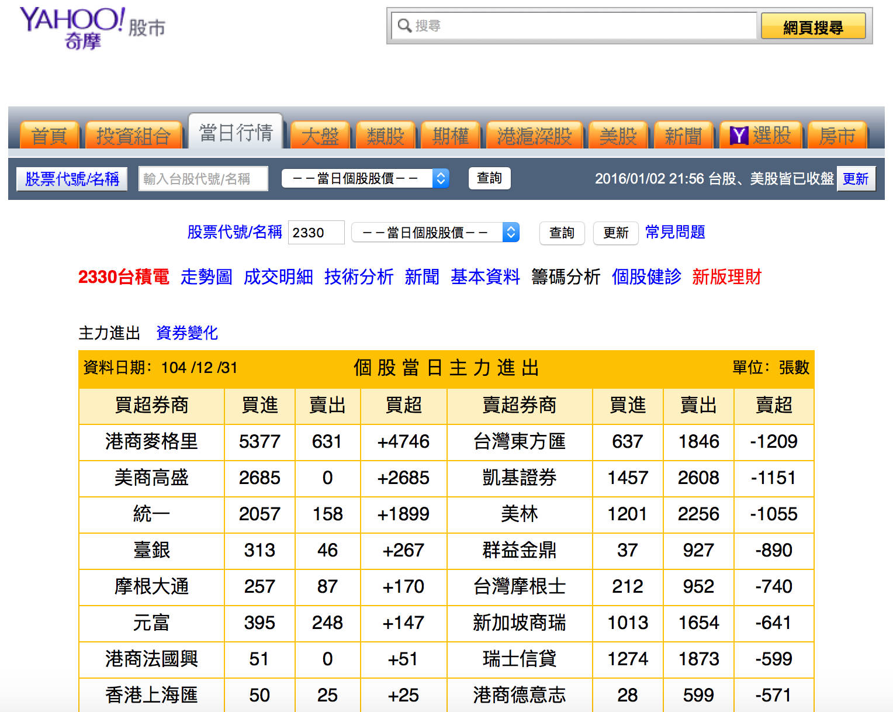
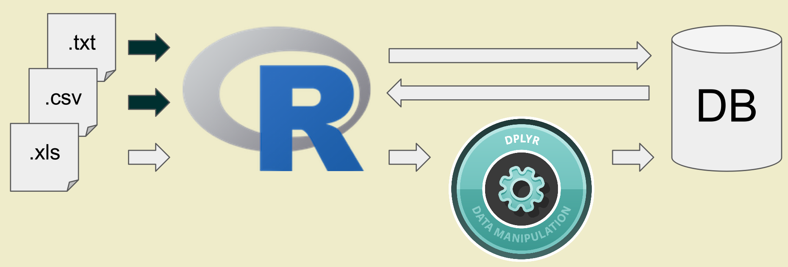
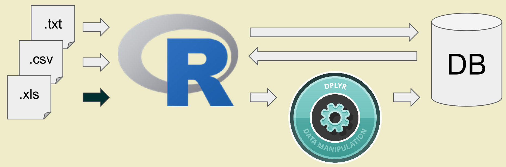
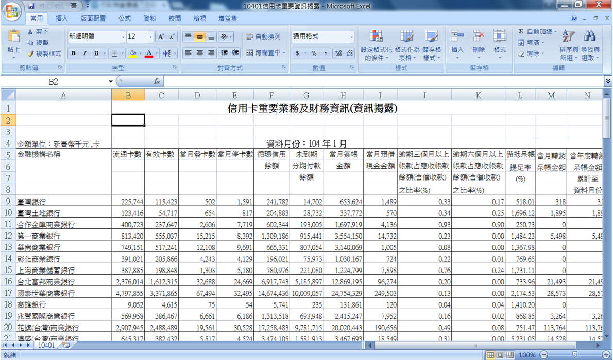
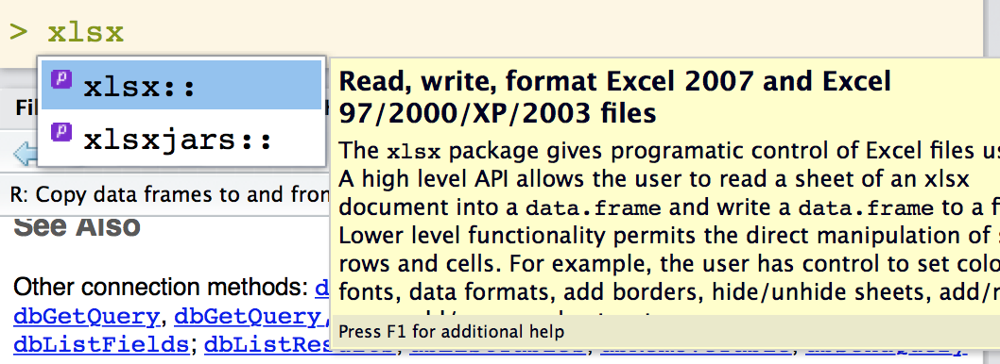
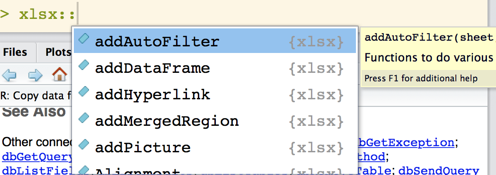
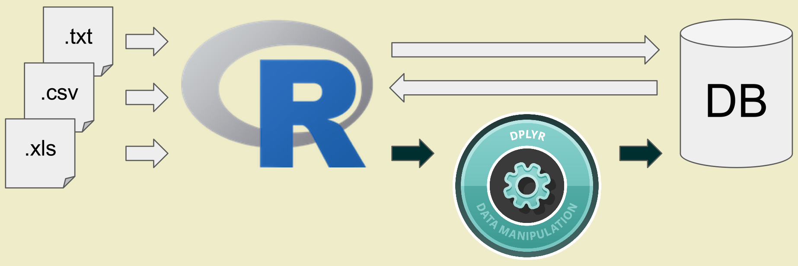
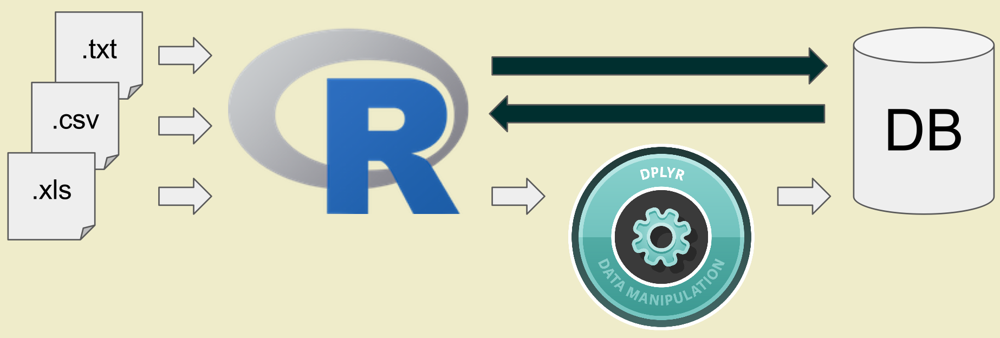

# 0 關於教材授權

本教材之智慧財產權，
屬木刻思股份有限公司所有。

如果有朋友，覺得此教材很棒，希望能分享給朋友，或是拿此教材開課。非常歡迎大家來信至 course@agilearning.io 請求教材的使用授權唷！

---

# 1.1 ＥＴＬ資料清理

- ## 什麼時候需要做資料清理？

- ## 其實 ETL 距離日常生活沒有這麼遙遠，在平常工作中會使用到 SQL、Excel 等等來進行報表製作，而將原始資料整理成報表裡面的結構化資料，就是 ETL。

- ## [Ｅ] `Extract` [Ｔ] `Transform` [Ｌ] `Load`

- ## 上完這堂課，你會學到：



<!-- end of list -->

---

# 1.2 重要套件 `packages` 與函式 `functions`

- ## `readLine` | `read.table`

```{r}
?readLines
?read.table
```

- ## `XLConnect` | `xlsx`

```{r}
library(XLConnect)
library(xlsx)
```

- ## `readxl`

```{r}
library(readxl)
```

- ## `magrittr` | `dplyr`

```{r}
library(magrittr)
library(dplyr)
```

- ## `RSQLite`

```{r}
library(RSQLite)
```

<!-- end of list -->

---

# 1.3 範例資料準備

- ## 1. 打開 `shell` 輸入指令下載資料集

    `git clone https://github.com/suensummit/RCourseBankSinoPac.git`

- ## 2. 在 RStudio console 輸入指令，切換工作目錄並確認下載內容。

```{r, eval=FALSE}
setwd("RCourseBankSinoPac")
```
```{r}
dir()
```

<!-- end of list -->

---

# 1.4 環境設定： `rJava` 安裝

- 在 Windows 系統裡使用 R，有時候會遇到一些棘手的 error；其中除了跟系統編碼（顯示亂碼）相關的問題以外，有一大宗都跟 `rJava` 這個套件有關。

- 今天先帶領大家操作一次，當遇到問題時，可以如何去解決。

```{r}
library(rJava)
```

- 下載 64 bits 版本的 Java（for Windows）[Download](http://javadl.sun.com/webapps/download/AutoDL?BundleId=113219)



<!-- end of list -->

---

# 1.5 暖身

## 練習操作：複習Ｒ語法

### 小提示 Tips

- ### 工作目錄 working directory
    - #### `getwd`
    - #### `setwd`
    - #### `dir`
   
- ### 自動補齊 autocompletion
    - #### `tab`

- ### 執行命令 source
    - #### `control` + `enter`

- ### 註解增減 comment
    - #### `shift` + `control` + `c`

<!-- end of list -->

```{r}
library(Lahman)
## View Data
head(Batting)
tail(Batting)

## View(Batting)
summary(Batting)

## explore data structure
str(Batting)
str(attributes(Batting))
class(Batting)

## data shape
dim(Batting)
ncol(Batting)
nrow(Batting)
```

<!-- end of list -->

---

# 2.1 什麼是資料第二問：資料「應該」長怎樣


- ### Data Schema Matters！

- ### 資料結構是重要的

## 2.1.1 以第一週 Yahoo Stock 資料為例



- ### [2330 台積電](http://tw.stock.yahoo.com/d/s/major_2330.html)

```{r}
library(httr)
library(rvest)

## Connector
Target_URL = "http://tw.stock.yahoo.com/d/s/major_2330.html"
res <- GET(Target_URL)
doc_str <- content(res, type = "text", encoding = "big5")

## Parser
if (.Platform$OS.type == "windows"){
  Sys.setlocale(category='LC_ALL', locale='C')
  data_table <- doc_str %>% read_html(encoding = "big-5") %>% html_nodes(xpath = "//table[1]//table[2]") %>% html_table(header=TRUE)
  Sys.setlocale(category='LC_ALL', locale='cht')
  data_table <- apply(data_table[[1]],2,function(x) iconv(x,from = "utf8"))
  colnames(data_table) <- iconv(colnames(data_table), from = "utf8")
}  else{
  data_table <- doc_str %>% read_html(encoding = "big-5") %>% html_nodes(xpath = "//table[1]//table[2]") %>% html_table(header=TRUE)
  data_table <- data_table[[1]]
}
# View(data_table)
data_table
```

<!-- end of list -->

---

## 2.1.2 想想看，這樣的資料有什麼問題？

- ### 左右兩欄的表格應該整併成同一欄

- ### 並且加入時間欄位、股票名稱

- ### 才能塞進資料庫／檔案做儲存或進一步應用

```{r}
head(data_table)
colnames(data_table) <- c("券商", "買進", "賣出", "差距", "券商", "買進", "賣出", "差距")
stockMajor <- rbind(data_table[,1:4], data_table[,5:8])
# stockMajor <- cbind(日期 = c(Sys.Date()), 股票代號 = c("2330"), 股票名稱 = c("台積電"), stockMajor)
stockMajor <- cbind(日期 = c("2015-12-31"), 股票代號 = c("2330"), 股票名稱 = c("台積電"), stockMajor)
# View(stockMajor)
head(stockMajor)
```

### 練習：Yahoo Stock

- ### [2451 創見](http://tw.stock.yahoo.com/d/s/major_2451.html)

<!-- end of list -->

---

# 2.2 一般文字資料處理



- ### 我今天拿到一個文字檔案

- 範例：[銀行局](https://survey.banking.gov.tw/statis/stmain.jsp?sys=100&funid=r100) 房貸餘額 [csv](https://raw.githubusercontent.com/suensummit/RCourseBankSinoPac/gh-pages/data/cl_info_other.csv)

<!-- end of list -->

---

## 2.2.1 取得資料後的第一步，是「觀察」

- ### 首先，觀察檔案的格式、欄位、資料型態

- ### 利用 `readLines`，先把前幾筆資料讀進來觀察

```{r}
res <- readLines(con = "data/cl_info_other.csv", n = 10L, encoding = "BIG-5")
iconv(res,from='utf8',to='big5')
head(res)
```

<!-- end of list -->

---

- ### 其他都可以忘記，至少要記得 `read.table`

## 2.2.2 利用觀察的結果「提供資訊」增進讀檔的效率

- ### 利用 `colClasses` 指定資料中欄位的大小及資料型態，讓讀檔速度加快（執行時不用去猜資料的大小、格式與資料型態）

```{r}
# library(RCurl)
# Cl_info = read.table(sep=",", header=TRUE, stringsAsFactors=F, file=textConnection(getURL("https://raw.githubusercontent.com/suensummit/RCourseBankSinoPac/gh-pages/data/cl_info_other.csv")))

Cl_info = read.table(file = "data/cl_info_other.csv", sep = ",", stringsAsFactors = F, header = T, colClasses = c("character", "character", "character", "character", "numeric", "numeric", "numeric", "numeric", "numeric", "numeric", "numeric", "numeric", "numeric", "numeric"), encoding = "utf8")
head(Cl_info)
str(Cl_info)
```

- ### 輸出形態為 Data Frame

- ### `file` 就是指讀入的檔案路徑

- ### `sep` 指的是欄位分割用的符號,通常 csv 檔案格式是透過,做分割

- ### stringsAsFactors 預設是 `True`， 讓讀入的字串用 `factor` 儲存，那麼資料就會轉為整數儲存與對照表

- ### header 預設是 `False`，表示第一行是不是表格標頭，輸出的 data.frame 欄位名的 `colnames`

<!-- end of list -->

---

## 2.2.3 

- ### 使用 `write.table` 寫資料

```{r, eval=FALSE}
write.table(x = Cl_info, file = "data/cl_info_other_update.csv", sep = ",", quote = FALSE)
```

<!-- end of list -->

---

# 2.3 ＥＸＣＥＬ資料處理



- ## Excel 不等於 Table！



## (a) `gdata`

- ### [在 Windows 系統中需要另外安裝 Perl](https://cran.r-project.org/web/packages/gdata/INSTALL)

```{r}
## Need Perl on Windows
library(gdata)
```

## (b) `XLConnect` and `xlsx`

- ### 需要 `rJava`，另外在處理中文編碼時需要使用 `iconv` 輔助。

```{r}
## Need Java/rJava
library(XLConnect)
library(xlsx)
```

## (c) `readxl`

- ### [Hadley](https://github.com/hadley) 出品，開發中，可搭配 `dplyr`（`tbl` 物件）

```{r}
## No dependency
library(readxl)
```

<!-- end of list -->

---

## 2.3.1 觀察

- ### 首先，觀察檔案的格式、欄位、資料型態


## 複習一下

- ### `套件::函式（public）`

- ### `套件:::函式（private）`





- ### c-1 使用 `readxl::excel_sheets` 取得 Excel 檔案的表單資訊（sheet）

```{r}
# library(readxl)
filename <- "data/10401信用卡重要資訊揭露.xlsx"
sheetNames <- readxl::excel_sheets(filename)
sheetNames
```

- ### c-2 利用 `readxl:::xlsx_col_types` 觀察資料中欄位的大小及資料型態，讓讀檔速度加快（執行時不用去猜資料的大小、格式與資料型態）

```{r}
colTypes <- readxl:::xlsx_col_types(path = filename, nskip = 10, n = 1)
colTypes
```

- ### c-3 再用 `readxl::read_excel` 讀檔、`xlsx::write.xlsx2` 寫檔

```{r}
resxl <- readxl::read_excel(filename, sheet = sheetNames[1], col_names = FALSE, skip = 8, col_types = colTypes)
colnames(resxl) <- c("金融機構名稱", "流通卡數", "有效卡數", "當月發卡數", "當月停卡數", "循環信用餘額", "未到期分期付款餘額", "當月簽帳金額", "當月預借現金金額", "逾期三個月以上帳款占應收帳款餘額含催收款之比率", "逾期六個月以上帳款占應收帳款餘額含催收款之比率", "備抵呆帳提足率", "當月轉銷呆帳金額", "當年度轉銷呆帳金額累計至資料月份")
dataLength <- sum(1 - is.na(resxl$流通卡數))
resxl <- resxl[1:dataLength,]
# colnames(resxl) <- iconv(colnames(resxl), 'utf8', 'big5')
str(resxl)
# View(resxl)
```

<!-- end of list -->

---

## 2.3.2 大量同樣格式的檔案，包成 `function` 批次執行。

```{r}
setwd("./data/")
filenames <- dir(pattern = "*.xlsx")
readCreditExcel <- function(filename) {
  sheetNames <- readxl::excel_sheets(filename)
  colTypes <- readxl:::xlsx_col_types(path = filename, nskip = 10, n = 1)
  resxl <- readxl::read_excel(filename, sheet = sheetNames[1], col_names = FALSE, skip = 8, col_types = colTypes)
  colnames(resxl) <- c("金融機構名稱", "流通卡數", "有效卡數", "當月發卡數", "當月停卡數", "循環信用餘額", "未到期分期付款餘額", "當月簽帳金額", "當月預借現金金額", "逾期三個月以上帳款占應收帳款餘額含催收款之比率", "逾期六個月以上帳款占應收帳款餘額含催收款之比率", "備抵呆帳提足率", "當月轉銷呆帳金額", "當年度轉銷呆帳金額累計至資料月份")
  dataLength <- sum(1 - is.na(resxl$流通卡數))
  resxl <- resxl[1:dataLength,]
  resxl <- cbind(月份 = substr(filename, 1, 5), resxl)
  return(resxl)
}
filenames
creditData <- lapply(filenames, readCreditExcel)
creditData <- do.call("rbind", creditData)
# View(creditData)
setwd("../")
```

<!-- end of list -->

---

# 3.1 R ETL with `dplyr`



- ### 接下來，真正開始在 R 裡面來做 ETL 資料清理的工作。

## 簡介 `dplyr`

- ### 官方的學習文件：`vignette`

```{r, eval=FALSE}
library(dplyr)
vignette(all = TRUE, package = "dplyr")
vignette("introduction", package = "dplyr")
```

- ### 讓 R 使用者可以用更有彈性的方式來處理資料

- ### 針對 data.frame 做設計（名稱中的 d）

- ### 設計理念
    + ### 導入資料整理最重要的操作（非常類似 SQL）
    + ### 快速與方便
    + ### 支援異質資料源（`data.frame` 或資料庫中的表格 `tbl  `）

<!-- end of list -->

---

## dplyr 快速簡介

- ### `select` 對欄位做篩選

- ### `filter` 對資料列做篩選

- ### `mutate` 變更或新增欄位

- ### `arrange` 排序、排列

- ### `group_by` + `summarise` 分類

- ### `bind` 合併資料表

<!-- end of list -->

---

## 3.1.1 `select`

- ### `Cl_demo1 = select(資料表, 欄位1, 欄位2, 欄位3)`

- ### 對應的 SQL 語法：
`select data_dt, bank_nm, mortgage_bal from Cl_info ;`

```{r}
# Example 1: select
Cl_demo1 = select(Cl_info, data_dt, bank_nm, mortgage_bal)
head(Cl_demo1)
```

<!-- end of list -->

---

## 3.1.2 `filter`

- ### `Cl_demo2 = filter(Cl_info, mortgage_bal > 1000000)`

- ### 對應的 SQL 語法：
`select * from Cl_info where mortgage > 1000000 ;`

```{r}
# Example 2: filter
Cl_demo2 = filter(Cl_info, mortgage_bal > 1000000)
head(Cl_demo2)
```

<!-- end of list -->

---

## 3.1.3 `mutate`

- ### `Cl_demo3 = mutate(資料表, 新欄位名 = 運算式)`

- ### 對應的 SQL 語法：
`select mortgage_bal/1000000 as mortage from Cl_info ;`

```{r}
# Example 3: mutate
Cl_demo3 = mutate(Cl_info, mortage = mortgage_bal/1000000)
head(Cl_demo3)
```

<!-- end of list -->

---

## 3.1.4 `arrange`

- ### `Cl_demo4 = arrange(資料表, 欄位1, desc(欄位2)))`

- ### 對應的 SQL 語法：
`select * from Cl_info order by mortage, data_dt desc ;`

```{r}
# Example 4: arrange
Cl_demo4 = arrange(Cl_info, mortgage_bal, desc(data_dt))
head(Cl_demo4)
```

<!-- end of list -->

---

## 3.1.5 `group_by` + `summarise`

- ### `Cl_demo5 = summarise(group_by(資料表, 用以分組的欄位), 彙總欄位)`

- ### 對應的 SQL 語法：
`select mean(mortgage_cnt) from Cl_info group by bank_nm ;`

```{r}
# Example 5: group_by + summarise
Cl_demo5 = summarise(group_by(Cl_info, bank_nm), mean(mortgage_cnt))
head(Cl_demo5)
```

<!-- end of list -->

---

# 3.2 範例演練

- 實際拿剛才的 EXCEL 資料來處理

```{r}
# Example:
creditDataCompete <- select(creditData, 金融機構名稱, 月份, 流通卡數, 有效卡數, 當月發卡數, 當月停卡數, 逾期三個月以上帳款占應收帳款餘額含催收款之比率) %>% mutate(使用率 = (有效卡數/流通卡數)*100, 當月增減 = 當月發卡數 - 當月停卡數) %>% arrange(金融機構名稱)

head(creditDataCompete)
```

<!-- end of list -->

---

# 3.3 R 與 Database 的串接：以 SQLite 為例



```{r}
library(DBI)
# Create an ephemeral in-memory RSQLite database
con <- dbConnect(RSQLite::SQLite(), ":memory:")

dbListTables(con)
dbWriteTable(con, "Batting", Batting)
dbListTables(con)

dbListFields(con, "Batting")
# dbReadTable(con, "Batting")

# You can fetch all results:
res <- dbSendQuery(con, "SELECT * FROM Batting WHERE playerID = 'jeterde01'")
dbFetch(res)
dbClearResult(res)

# Or a chunk at a time
res <- dbSendQuery(con, "SELECT * FROM Batting WHERE playerID = 'jeterde01'")
while(!dbHasCompleted(res)){
  chunk <- dbFetch(res, n = 5)
  print(nrow(chunk))
}
# Clear the result
dbClearResult(res)

# Disconnect from the database
dbDisconnect(con)
```

## 補充：[使用 dplyr 與資料庫連接](http://www.inside-r.org/node/230652)

```{r}
?src_sqlite
```

## 請大家操作範例資料

### [範例資料簡介](http://mlr.cs.umass.edu/ml/datasets/Bank+Marketing)

### [下載範例資料](http://mlr.cs.umass.edu/ml/machine-learning-databases/00222/bank.zip)

```{r}
res <- read.csv("data/bank/bank-full.csv", header = TRUE, sep = ";")
head(res)
str(res)
```

<!-- end of list -->

---

# 4.1 今日重點回顧：Take Home Messages


## - 資料結構是重要的，三思而後行！
#### 想想看，要排成怎樣的表格，才方便使用？

## - 觀察
#### RData/DataFrame：`head` + `tail` + `summary`
#### txt/csv：`readLines` + `read.table`
#### Excel：`readxl:::xlsx_col_types`

## - Excel檔案
#### `gdata`
#### `XLConnect` + `xlsx`
#### `readxl`

## - `dplyr` <-> SQL

## - 資料庫
#### Connect
#### Query
#### Disconnect

<!-- end of list -->

---

# 4.2 Q & A

## - [四周課程列表](./index.html)

<!-- end of list -->

---

# 5 Appendix

## 5.1.1 Read Excel Files (b) Solution

### b-1 使用 `XLConnect::loadWorkbook` 取得 Excel 檔案的表單資訊（sheet）

### b-2 接著利用 `xlsx::read.xlsx2`，先把前幾行資料讀進來觀察，預先設定欄位的大小及資料型態 `colClasses`，讓讀檔速度加快（執行時不用去猜資料的大小、格式與資料型態）

### b-3 再用 `xlsx::read.xlsx2` 讀檔（較快），`xlsx::write.xlsx2` 寫檔

<!-- end of list -->

---
